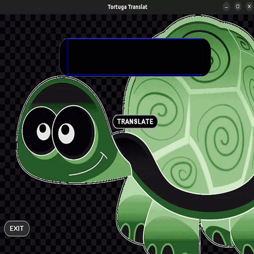

# Tortuga-translate

Universal Translation Program
Tortuga Translate is a GUI creation with Tkinter and Canvas

## Ferramentas

1. Linguagem: [Python](https://www.python.org/) 
2. Framework: [Tkinter](https://docs.python.org/3/library/tkinter.html) [Canvas](https://pythonbasics.org/tkinter-canvas/)
3. Plataforma de Hospedagem: 

## Get Started

1. Baixe o arquivo app.py junto com seu código
2. Adicionar as libs necessárias para o seu projeto no arquivo [requirements.txt](./requirements.txt)
3. Estou usando Linux Ubuntu 22.04.2 LTS

## Testar Local

Para testar local execute o seguinte comando
no diretorio :

No Linux :

~~~
 python3 app.py run
~~~

No Windows :

~~~
 python app.py run
~~~

## Testar em Rede
Para testar em rede execute o seguinte comando
no diretorio :

## Instruções

No input digite o texto que gostaria de traduzir e clique no botão translate .

    

---
Developed by [Anderson B.O.B](https://github.com/eusouanderson)
